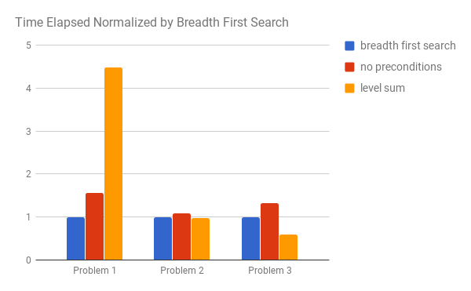
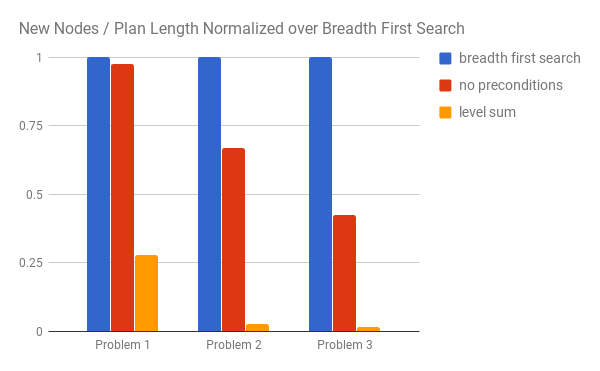
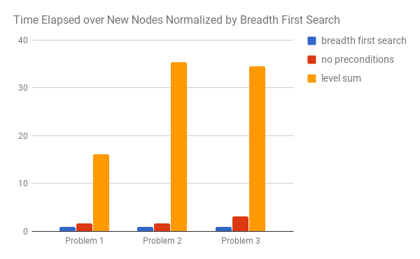

### Provide an optimal plan for Problems 1, 2, and 3.

#### Problem 1

##### Initial condition and goal

```
Init(At(C1, SFO) ∧ At(C2, JFK) 
	∧ At(P1, SFO) ∧ At(P2, JFK) 
	∧ Cargo(C1) ∧ Cargo(C2) 
	∧ Plane(P1) ∧ Plane(P2)
	∧ Airport(JFK) ∧ Airport(SFO))
Goal(At(C1, JFK) ∧ At(C2, SFO))
```

##### Optimal solution

```
Load(C1, P1, SFO)
Load(C2, P2, JFK)
Fly(P2, JFK, SFO)
Unload(C2, P2, SFO)
Fly(P1, SFO, JFK)
Unload(C1, P1, JFK)
```

#### Problem 2

##### Initial condition and goal

```
Init(At(C1, SFO) ∧ At(C2, JFK) ∧ At(C3, ATL) 
	∧ At(P1, SFO) ∧ At(P2, JFK) ∧ At(P3, ATL) 
	∧ Cargo(C1) ∧ Cargo(C2) ∧ Cargo(C3)
	∧ Plane(P1) ∧ Plane(P2) ∧ Plane(P3)
	∧ Airport(JFK) ∧ Airport(SFO) ∧ Airport(ATL))
Goal(At(C1, JFK) ∧ At(C2, SFO) ∧ At(C3, SFO))
```

##### Optimal solution

```
Load(C1, P1, SFO)
Fly(P1, SFO, JFK)
Load(C2, P2, JFK)
Fly(P2, JFK, SFO)
Load(C3, P3, ATL)
Fly(P3, ATL, SFO)
Unload(C3, P3, SFO)
Unload(C2, P2, SFO)
Unload(C1, P1, JFK)
```

#### Problem 3

##### Initial condition and goal

```
Init(At(C1, SFO) ∧ At(C2, JFK) ∧ At(C3, ATL) ∧ At(C4, ORD) 
	∧ At(P1, SFO) ∧ At(P2, JFK) 
	∧ Cargo(C1) ∧ Cargo(C2) ∧ Cargo(C3) ∧ Cargo(C4)
	∧ Plane(P1) ∧ Plane(P2)
	∧ Airport(JFK) ∧ Airport(SFO) ∧ Airport(ATL) ∧ Airport(ORD))
Goal(At(C1, JFK) ∧ At(C3, JFK) ∧ At(C2, SFO) ∧ At(C4, SFO))
```

##### Optimal solution

```
Load(C1, P1, SFO)
Load(C2, P2, JFK)
Fly(P2, JFK, ORD)
Load(C4, P2, ORD)
Fly(P1, SFO, ATL)
Load(C3, P1, ATL)
Fly(P1, ATL, JFK)
Unload(C1, P1, JFK)
Unload(C3, P1, JFK)
Fly(P2, ORD, SFO)
Unload(C2, P2, SFO)
Unload(C4, P2, SFO)
```


### Compare and contrast non-heuristic search result metrics (optimality, time elapsed, number of node expansions) for Problems 1,2, and 3. 

```Note: Include breadth-first, depth-first, and at least one other uninformed non-heuristic search in your comparison; Your third choice of non-heuristic search may be skipped for Problem 3 if it takes longer than 10 minutes to run, but a note in this case should be included.```

Breadth first search (BFS) takes a considerably longer time when compared to depth first search (DFS). The growth in search time in terms of problem complexity seems to be non-linear, but larger, with regards to the number of entities involved in the state space of the problem. However, it seems to find the most optimal solution in our test runs when compared to other non-heuristic, heuristic and Graphplan based heuristic search.

Depth first search (DFS) finds solutions very quickly while exploring a minimal amount of nodes when compared to other search methods. However, the solutions found with DFS is suboptimal. In some cases, the solution's plan length is orders of magnitude larger than the solutions found by BFS.

Depth limited search seems to have issues finding the solution as the state space increases with regards to the entities involved. In this case, the entites, cargoes and airports, increased in number.

Breadth first tree search could not find solutions for problems 2 and 3 within 14 minutes for problem 2 and 21 minutes for problem 3. It appears that the optimization that graph search provides over tree search makes dramatic improvements in performance to find solutions in state space search in Planning systems. This might be especially exemplified due to the nature of planning system state space where repeating node patterns arise very frequently during traversal.

Uniform cost search (UCS) seems to find the optimal solution, but takes longer and explores more state space when compared to BFS. One of the differences in performance is due to the requirement to calculate to find the shortest path in uniform cost vs. breadth first search. Lastly, BFS ends earlier with less node expansions due to the implementation detail where it evaluates the goal state upon expansion, but not on pop from the queue or data structure.


### Compare and contrast heuristic search result metrics using A* with the "ignore preconditions" and "level-sum" heuristics for Problems 1, 2, and 3.

Both ignore preconditions and level sum heuristics take less time to compute as the state space grows when compared to complete non-heuristic search methods, such as BFS, as shown on Chart 1 below.



##### Chart 1 - Time elapsed normalized by each problem's breadth first search time


This reduction in elapsed time can probably be mainly attributed to the fact that ignore preconditions and level sum expands less nodes compared to non-heuristic functions such as BFS, as shown on Chart 2. The chart indicates that as the problem becomes more complex, the number of new nodes explored dramatically decreases when using these heuristic functions. When comparing no preconditions to level sum heuristic function, you notice that the level sum with Planning Graph performs much better in terms of new nodes explored. But, as you can see in Chart 3, the time that it takes to find the next new node takes a longer time with these heuristic functions.




##### Chart 2: Ratio of new nodes to solution plan length normalized over breadth first search for each problem




##### Chart 3: Ratio of time elapsed per new node expansion normalized over breadth first search for each problem


Overall, as the problem becomes complex, the heuristic function helps by expanding less nodes in less time in total. Basically, as the state space increases, the directionality towards the solution provided by the heuristic functions helps the search function find the solution faster.


### What was the best heuristic used in these problems? Was it better than non-heuristic search planning methods for all problems? Why or why not?

The best heuristic in terms of nodes expanded was level sum heuristic using Planning Graph. However, it does not always find the most optimal solution, but a good solution. The ignore preconditions heuristic did always find the optimal solution in our data set. However, as the complexity of the domain insceased, the time to run ignore preconditions increased in a faster rate when compared to level sum heuristic. If optimality of solution is not paramount, and the domain is complex, Planning Graph's level sum heuristic seems to be a great tool. If optimality is of utmost importance, ignore preconditions, with its admissibility, could server well for the users when they can afford more time and space to find the solution.


##### Table 1 - Results data table

|       | expansions | goal tests | new nodes | plan length | heuristic |
| ----- | ---------: | ---------: | --------: | ----------: | --------: |
| p1s1* |         43 |         56 |       180 |           6 |         F |
| p1s2  |      1,458 |      1,459 |     5,960 |           6 |         F |
| p1s3  |         21 |         22 |        84 |          20 |         F |
| p1s4  |        101 |        271 |       414 |          50 |         F |
| p1s5  |         55 |         57 |       224 |           6 |         F |
| p1s9  |         42 |         44 |       176 |           6 |         T |
| p1s10 |         11 |         13 |        50 |           6 |         T |
|       |            |            |           |             |           |
| p2s1  |      3,343 |      4,609 |    30,509 |           9 |         F |
| p2s2  |            |            |           |             |         F |
| p2s3  |        624 |        625 |     5,602 |         619 |         F |
| p2s4  |            |            |           |             |         F |
| p2s5  |      4,853 |      4,855 |    44,041 |           9 |         F |
| p2s9  |      2,232 |      2,234 |    20,406 |           9 |         T |
| p2s10 |         86 |         88 |       841 |           9 |         T |
|       |            |            |           |             |           |
| p3s1  |     14,663 |     18,098 |   129,631 |          12 |         F |
| p3s2  |            |            |           |             |         F |
| p3s3  |        408 |        409 |     3,364 |         392 |         F |
| p3s4  |            |            |           |             |         F |
| p3s5  |     18,198 |     18,200 |   159,396 |          12 |         F |
| p3s9  |      6,191 |      6,193 |    55,097 |          12 |         T |
| p3s10 |        241 |        243 |     2,194 |          13 |         T |

\* The *Legend* below maps these to the the name of search and type of problem

\** timeouts means that it took over 10 minutes.


##### Legend 


p1s1 - Problem 1 using breadth_first_search...

p1s2 - Problem 1 using breadth_first_tree_search...

p1s3 - Problem 1 using depth_first_graph_search...

p1s4 - Problem 1 using depth_limited_search...

p1s5 - Problem 1 using uniform_cost_search...

p1s9 - Problem 1 using astar_search with h_ignore_preconditions...

p1s10 - Problem 1 using astar_search with h_pg_levelsum...

p2s1 - Problem 2 using breadth_first_search...

p2s2 - Problem 2 using breadth_first_tree_search...

...

p3s1 - Problem 3 using breadth_first_search...

...
